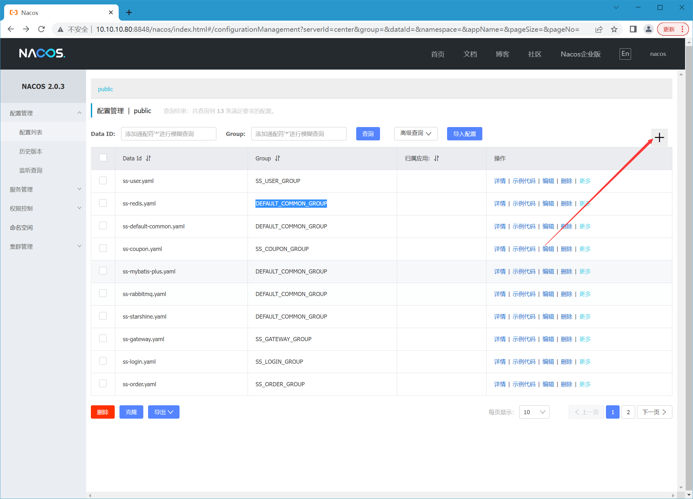
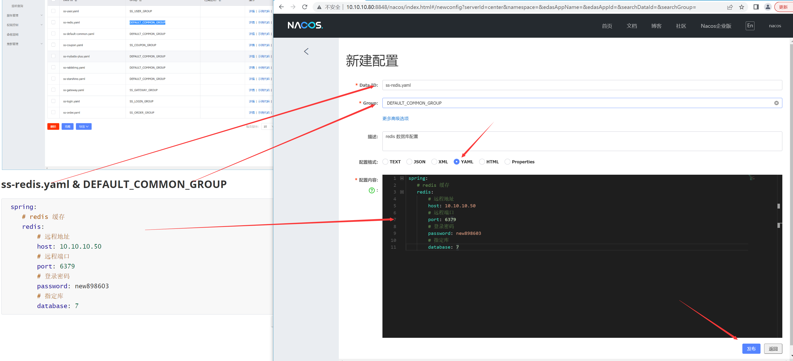
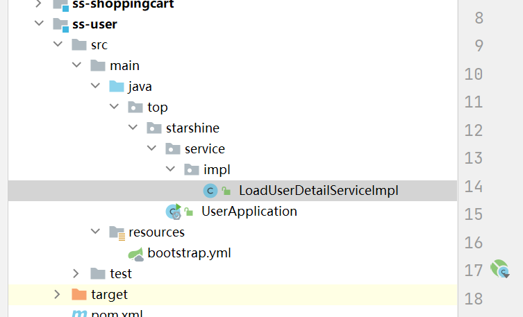
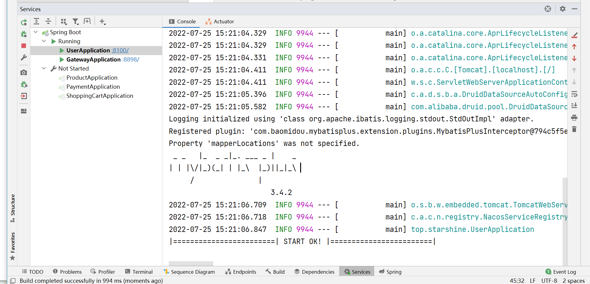
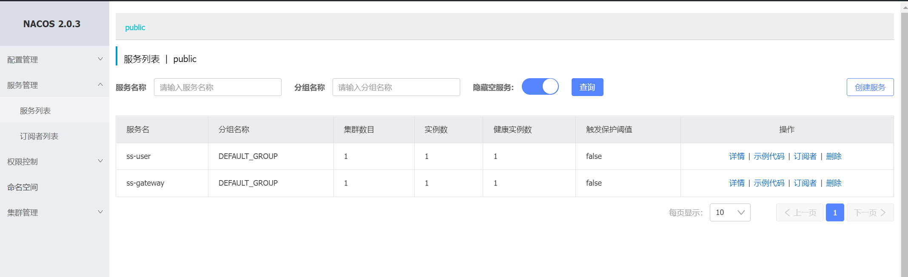
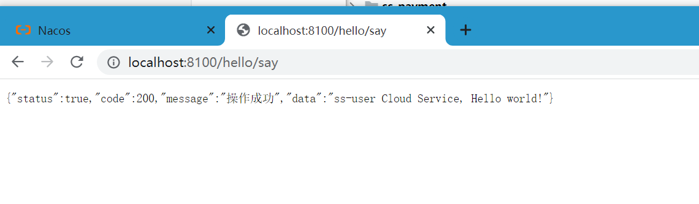
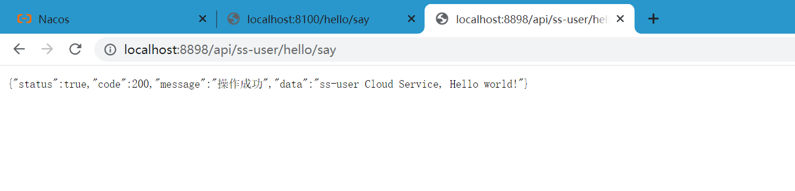

# 所有微服务初始化

## 注意：必须有如下软件才能启动，请安装好后操作

- mysql 数据库 5.6版本以上
- redis 数据库 
- rabbit MQ 消息队列
- nacos 阿里巴巴配置和注册中心 2.x 版本以上


## 配置中心创建公共配置文件

### 配置示例





## 大家按需填写分组(Group) ,不一定要按照我这样做

> ss-redis.yaml   

> DEFAULT_COMMON_GROUP

```yaml
 spring:
    # redis 缓存
    redis:
        # 远程地址
        host: 10.10.10.50
        # 远程端口
        port: 6379
        # 登录密码
        password: 您的密码
        # 指定库
        database: 7
```

> ss-default-common.yaml  

> DEFAULT_COMMON_GROUP

```yaml
spring:
    # 设置 jackson 日期时间
    jackson:
        date-format: yyyy-MM-dd HH:mm:ss
        time-zone: GMT+8
    # 文件上传
    servlet:
    multipart:
        # 单个文件请求最大上传容量
        max-request-size: 60MB
        # 单个文件支持最大上传容量
        max-file-size: 60MB

# 服务配置
server:
  # 开启 tomcat 的 gzip
  compression:
    enabled: true
    min-response-size: 1024
  # 配置 tomcat
  tomcat:
    uri-encoding: UTF-8
    #tomcat默认限制文件上传的大小是2MB ，超过就不会被捕获，需要调整大一点或者-1不限制
    max-swallow-size: -1

```

> ss-mybatis-plus.yaml
>
> DEFAULT_COMMON_GROUP

```yaml
mybatis-plus:
  # 设置包别名
  #  type-aliases-package:  top.starshine.musiccomponents.entity
  # xml 路径
  mapper-locations: classpath*:/mapper/*.xml
  # 日志
  configuration:
    # 日志接口
    log-impl: org.apache.ibatis.logging.stdout.StdOutImpl
```

>ss-rabbitmq.yaml
>
>DEFAULT_COMMON_GROUP

```yaml
spring:
    # 消息队列
    rabbitmq:
        host: 10.10.10.81
        port: 5672
        username: 您的账号
        password: 您的密码
        virtual-host: /
```

>ss-starshine.yaml
>
>DEFAULT_COMMON_GROUP

```yaml
starshine:
  # 异步线程池配置
  thread:
    pool:
      core-pool-size: 10
      keep-alive-time: 10
      maximum-pool-size: 100
      work-queue-size: 100000
```

## 每个微服务都有自己的配置文件

#### 分组看您的需要，也可以默认分组不一定要按照我的引用

> ss-user.yaml
>
> SS_USER_GROUP

```yaml
spring:
  # 配置链接数据库
  datasource:
	# 德鲁伊链接池
    type: com.alibaba.druid.pool.DruidDataSource
    driver-class-name: com.mysql.cj.jdbc.Driver
    # 数据库地址
    url: jdbc:mysql://10.10.10.51:3306/orders_take_out_coupon?useUnicode=true&characterEncoding=utf8&useSSL=false
    username: root
    password: JpEjDm3wmxyAa8LR
```

### 其他都一样，名字不同而已，里面的配置如上面，这里为什么要搞这么多配置文件是为了不同数据库链接，你也可以弄成一个配置，全部都公共

> 注意分配好每个微服务端口 ，我是按照微服务创建顺序分配，如： 81000 , 第一个微服务、8200 第二微服务。后面服务集群，如： 8101、8102

- 用户服务 ss-user 
- 产品服务 ss-product
- 订单服务 ss-order
- 支付服务 ss-payment
- 公共服务 ss-common
- 优惠券服务 ss-coupon
- 登录服务 ss-login
- 购物车服务 ss-shoppoingcart
- 网关服务 ss-gateway

## pom.xml 导入包

```xml
<?xml version="1.0" encoding="UTF-8"?>
<project xmlns="http://maven.apache.org/POM/4.0.0"
         xmlns:xsi="http://www.w3.org/2001/XMLSchema-instance"
         xsi:schemaLocation="http://maven.apache.org/POM/4.0.0 http://maven.apache.org/xsd/maven-4.0.0.xsd">
    <parent>
        <artifactId>openOrderTakeOutCloud</artifactId>
        <groupId>top.starshine.cloud</groupId>
        <version>1.0-SNAPSHOT</version>
    </parent>
    <modelVersion>4.0.0</modelVersion>

    <artifactId>ss-user</artifactId>

    <properties>
        <maven.compiler.source>8</maven.compiler.source>
        <maven.compiler.target>8</maven.compiler.target>
    </properties>

    <dependencies>

        <!--公共包-->
        <dependency>
            <groupId>top.starshine.cloud</groupId>
            <artifactId>ss-common</artifactId>
            <version>1.0-SNAPSHOT</version>
        </dependency>

    </dependencies>

</project>
```


## 目录结构如图



## 创建 bootstrap.yml

> 注意：若无法读取到配置中心的文件导致启动失败的，请检查是否缩进正确，yaml 必须缩进对齐才能读取正确！！！

```yaml
server:
  # 配置端口
  port: 8100

spring:
  application:
    # 用户服务
    name: ss-user
  cloud:
    nacos:
      username: nacos
      password: nacos
      discovery:
        enabled: true
        server-addr: 10.10.10.80:8848
        #namespace: public
      config:
        server-addr: 10.10.10.80:8848
        #namespace: public
        file-extension: yaml
        # 加载配置中心的文件
        extension-configs:
          - data-id: ss-user.yaml
            group: SS_USER_GROUP
            refresh: true
          - data-id: ss-redis.yaml
            group: DEFAULT_COMMON_GROUP
            refresh: true
          - data-id: ss-default-common.yaml
            group: DEFAULT_COMMON_GROUP
            refresh: true
          - data-id: ss-mybatis-plus.yaml
            group: DEFAULT_COMMON_GROUP
            refresh: true
          - data-id: ss-rabbitmq.yaml
            group: DEFAULT_COMMON_GROUP
            refresh: true
          - data-id: ss-starshine.yaml
            group: DEFAULT_COMMON_GROUP
            refresh: true

# 暴露监控断点，给后续的Admin进行监控处理
# 获取单独访问http://localhost:ip/actuator
management:
  endpoints:
    web:
      exposure:
        include: '*'
```

## 创建启动类

```java
package top.starshine;

import org.springframework.boot.SpringApplication;
import org.springframework.boot.autoconfigure.SpringBootApplication;
import org.springframework.cloud.client.discovery.EnableDiscoveryClient;

/**
 * <h3></h3>
 *
 * @author: starshine
 * @email: 183101655@qq.com
 * @version: 1.0
 * @since: 2022/7/24  下午 9:29  周日
 * @Description: hello world
 */
@EnableDiscoveryClient  //开启服务注册功能配置功能
@SpringBootApplication
public class UserApplication {

    public static void main(String[] args) {
        SpringApplication.run(UserApplication.class, args);
        System.out.println("|========================| START OK! |========================|");
    }

}

```

## 实现一个接口

```java
package top.starshine.service.impl;

import org.springframework.stereotype.Service;
import top.starshine.commons.entity.user.User;
import top.starshine.commons.model.token.LoadUserDetailService;

/**
 * <h3>令牌用户加载</h3>
 *
 * @author: starshine
 * @email: 183101655@qq.com
 * @version: 1.0
 * @since: 2022/7/24  下午 9:37  周日
 * @Description: hello world
 */
@Service
public class LoadUserDetailServiceImpl implements LoadUserDetailService {

    @Override
    public User getById(String id) {
        return new User();
    }

}

```

## 启动运行 UserApplication 





>浏览器访问 如下地址
>
>http://localhost:8100/hello/say



### 测试网关是否成功转发

>http://localhost:8898 是网关地址
>
>api 是前缀
>
>ss-user 是服务名 
>
>/hello/say 是来自公共模块里的 HelloController 提供，不需要创建，
>
>http://localhost:8898/api/ss-user/hello/say



# 其他微服务如上面案例一样操作吧，一定要做完一个微服务初始化，记得测试！

# 所有代码都在同级文件夹中的代码文件夹中